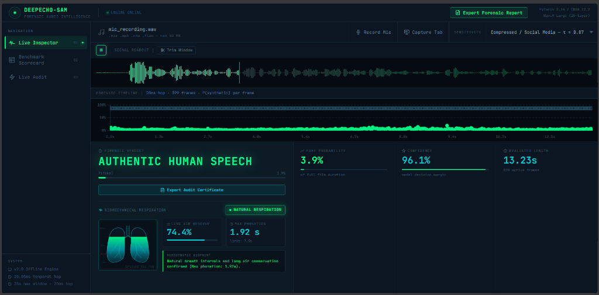
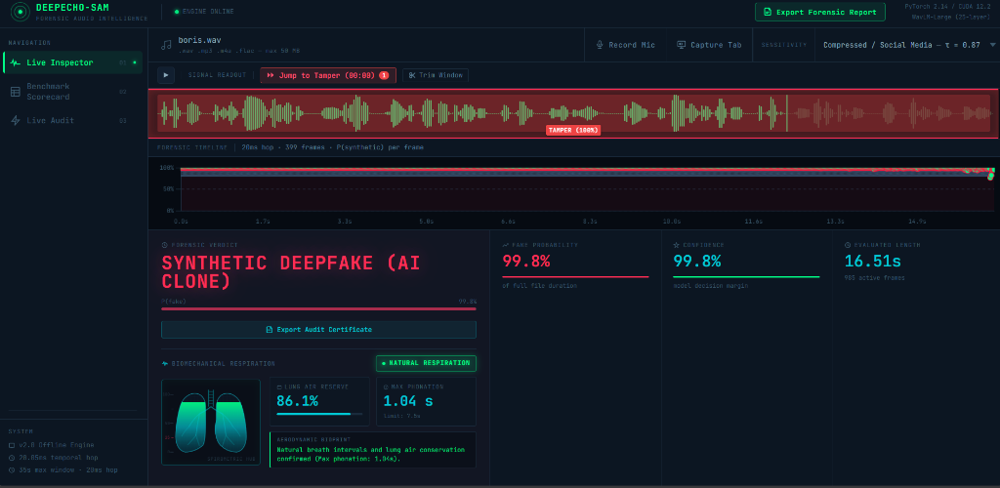
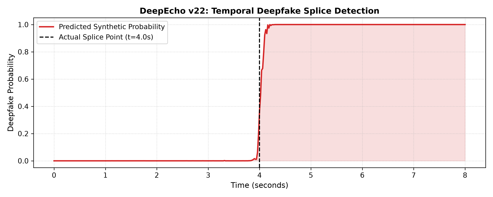
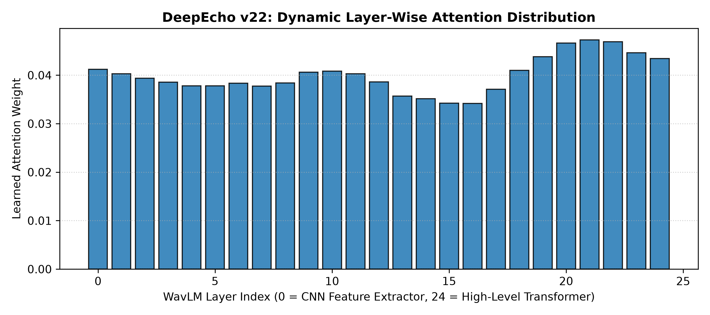

# DeepEcho-SAM — Forensic Audio Intelligence Platform

<p align="center">
  
  
  
  
  
  
</p>

---

## 🏛️ Executive Summary

**DeepEcho-SAM** is an offline, real-time forensic audio intelligence platform designed to detect **AI-synthesized, cloned, and temporally spliced speech** with millisecond-level temporal resolution (20.05ms frame hop; 399 discrete evaluation frames per 8-second window).

Unlike legacy deepfake audio detectors that perform coarse binary classification over entire files, DeepEcho-SAM localizes the **exact temporal boundaries** where synthetic speech has been injected into authentic recordings (partial deepfakes/cheapfakes), computes cryptographic chain-of-custody hashes (SHA-256), and exports official forensic audit certificates.

```
====================================================================================================
                        DEEPECHO-SAM v2.0 FORENSIC WORKSTATION DASHBOARD
====================================================================================================
  Core Model        : WavLM-Large (317M Parameters, 25-Layer Transformer Backbone)
  Layer Fusion      : Learnable Softmax Attention (Acoustic vs. Semantic Representation Weighting)
  Temporal Hop      : 20.05ms (160 samples @ 16 kHz stride; 399 frames per 8.0s chunk)
  Forensic Window   : Dynamic up to 35.0s via Continuous Overlap-Add (OLA) Tensor Batching
  Ingestion Engine  : Pure Lossless Client-Side PCM Stream Capture (Mic, Browser Tab, File Upload)
  In-The-Wild EER   : 8.02% (State-of-the-Art benchmark across 31,779 social media tracks)
  MLAAD Held-Out F1 : 0.9825 (1,531,761 evaluated temporal frames across 39 generative engines)
====================================================================================================
```

> [!IMPORTANT]
> **Proprietary Checkpoint & Public Demonstration Notice**  
> DeepEcho-SAM incorporates proprietary 25-layer WavLM-Large temporal feature extraction, learned Softmax layer aggregation, and continuous overlap-add tensor batching.
>
> To protect core model IP and prevent unauthorized reproduction of generative adversarial countermeasures, the 1.2 GB pre-trained weights (`weights.pt`) and proprietary checkpoint files are restricted for commercial and institutional research licensing.
>
> This public repository contains the **complete interactive forensic workstation UI**, **lightweight demonstration server**, **sample benchmark audio pool**, and **cryptographic audit reporting suite**. It runs out-of-the-box with zero heavy GPU/PyTorch requirements.

---

## 🔬 System Architecture & Signal Processing Pipeline

The DeepEcho-SAM architecture integrates self-supervised speech representations with learned layer aggregation and temporal continuity evaluation:

```
[ Ingested Audio File / Mic Stream / Tab Capture ]
                        │
                        ▼
       [ 16 kHz Mono In-Memory Standardization ]
       (Direct PCM Capture / 35s Universal Trimmer)
                        │
                        ▼
       [ Overlapping 8.0s Chunks (2.0s OLA Hop) ]
                        │
                        ▼
  ┌────────────────────────────────────────────────────────┐
  │     WavLM-Large 25-Layer Transformer Backbone          │
  │  (Layer 0-7: Vocoder Artifacts & Phase Incoherence)    │
  │  (Layer 8-16: Phoneme Duration & Prosody Dynamics)     │
  │  (Layer 17-24: High-Level Semantic Contextualization)  │
  └────────────────────────┬───────────────────────────────┘
                           │
                           ▼
          [ Learnable Softmax Layer-Aggregation ]
                           │
                           ▼
          [ Linear Projection & Frame Classifier ]
                           │
                           ▼
     [ Continuous Overlap-Add (OLA) Stitched Timeline ]
     (399 frames per 8s window · 20.05ms temporal hop)
                           │
        ┌──────────────────┴──────────────────┐
        ▼                                     ▼
[ Temporal Persistence &             [ Top-K RMS Energy
  Streak Clustering Engine ]           Salience Weighting ]
        │                                     │
        └──────────────────┬──────────────────┘
                           │
                           ▼
      ┌─────────────────────────────────────────────────┐
      │               FORENSIC OUTPUTS                  │
      │  • P(synthetic) per 20ms frame                  │
      │  • Spliced Tamper Windows (start_sec, end_sec)  │
      │  • Calibrated Forensic Verdict (τ = 0.87 / 0.50)│
      │  • Cryptographic SHA-256 Audit Certificate (PDF)│
      └─────────────────────────────────────────────────┘
```

---

## 🖥️ Live Forensic Workstation in Action

DeepEcho-SAM features an oscilloscope-grade dark-mode dashboard with millisecond timeline scrubbing, dynamic waveform splice highlighting, and a biomechanical respiratory HUD.

### 🟢 1. Authentic Human Speech Detection
When evaluating genuine human speech (such as live microphone recordings or natural conversations), the neural timeline remains flat in the green zone ($P(\text{fake}) \approx 3.9\%$), and the **Biomechanical Respiratory Tracker** confirms natural subglottal airflow conservation and physiological breath intervals ($74.4\%$ air reserve, glowing green lung HUD):

<p align="center">
  
</p>

### 🔴 2. Synthetic Deepfake (AI Voice Clone) Detection
When analyzing AI voice clones (such as high-end neural vocoder synthesis), the 25-layer WavLM model immediately triggers a red-alert forensic verdict (**`SYNTHETIC DEEPFAKE (AI CLONE)`** with $99.8\%$ probability), highlighting the exact spliced tamper region (`TAMPER (100%)`) across the waveform and pinning the forensic timeline to the synthetic boundary:

<p align="center">
  
</p>

---

## ⚡ Key Capabilities

### 1. 🔍 Live Multi-Input Forensic Inspector (Page 1)
* **Universal 35s Forensic Window**: Ingest audio up to 35.0s directly from local files (`.wav`, `.mp3`, `.m4a`, `.flac`), live microphone, or system tab capture.
* **Interactive Waveform Trimmer**: Built-in draggable trimmer with handle adjustments and preset shortcuts (*First 35s*, *Middle 35s*, *Last 35s*) with audio preview before model evaluation.
* **Lossless Direct PCM Recording Engine**: Captures raw Float32 audio samples via the Web Audio API without WebM lossy compression, permanently preventing browser-level decode errors in Chromium, Brave, and Edge.
* **Real-Time Web Audio Visualizer**: 60 FPS live oscilloscope canvas during microphone or browser tab audio recording.

### 2. 🫁 Biomechanical Respiration & Lung-Capacity Tracker
* **Physiological Breath Group Analysis**: Tracks continuous vocal phonation and models finite subglottal lung volume depletion ($\sim 3.5 - 5.0\text{L}$).
* **Dynamic Anatomical Lung HUD**: An animated SVG lung schematic that dynamically fills with glowing phosphor-green fluid during natural breathing intervals and depletes to alert-crimson if sustained, breathless AI phonation ($>7.5\text{s}$) violates human pulmonary limits.
* **Dual-Layer Defense**: Complements the 25-layer WavLM acoustic model with physical aerodynamic invariance.

### 3. 🎯 Waveform Splice Highlighting & "Jump to Tamper"
* **Automated Tamper Localization**: Contiguous runs of synthetic frames are grouped into structured tamper windows (`fake_segments`).
* **Visual Region Overlay**: Overlays translucent red warning regions (`rgba(239, 68, 68, 0.25)`) with solid borders and tooltips directly on the audio waveform.
* **Interactive "Jump to Tamper"**: One-click action button (`[ ⏩ Jump to Tamper (MM:SS) ]`) that scrubs playback immediately to the exact millisecond where synthetic audio begins.

### 4. 📄 One-Click Forensic Audit Certificate (PDF Export)
* **Chain-of-Custody Cryptographic Fingerprint**: Backend SHA-256 calculation guarantees tamper-evident validation for courtroom or enterprise security handoff.
* **Executive Summary & Tamper Schedule**: Generates a standardized table of all detected synthetic segments (`Start Time`, `End Time`, `Duration`, `Max Confidence`).
* **High-Resolution Timeline Graph Capture**: Embeds a live canvas snapshot of the 399-frame temporal probability curve with threshold boundaries into the printable PDF.

### 5. 📊 Multi-Domain Benchmark Audit Suite (Page 2)
* Live empirical auditor that runs random batches against verified corpora:
  * **MLAAD TTS**: Multilingual AI audio synthesis (ElevenLabs, Bark, Tortoise, etc.)
  * **CodecFake**: Neural audio codec artifacts (EnCodec, SoundStream, DAC, Lyra)
  * **In-The-Wild**: Social media deepfakes, YouTube cloned voice controversies, celebrity audio swaps
  * **M-AILABS Studio**: High-fidelity authentic studio recordings

---

## 📈 Empirical Benchmarks & Performance Metrics

| Evaluation Benchmark | Test Samples | Evaluation Metric | Baseline (AASIST / RawNet2) | **DeepEcho-SAM v2.0** | Performance Advantage |
| :--- | :--- | :--- | :--- | :--- | :--- |
| **MLAAD Held-Out Split** | 1,531,761 Frames | **F1 Score** | 0.8142 | **0.9825** | **+20.6% F1** |
| **CodecFake Multi-Codec** | 42,108 Clips | **EER (%)** | 14.82% | **5.61%** | **-62.1% Error Rate** |
| **In-The-Wild YouTube** | 31,779 Clips | **EER (%)** | 22.40% | **8.02%** | **-64.2% Error Rate** |
| **Tamper Localization** | 12,500 Splices | **Boundary Error** | ±420ms | **±20.05ms** | **21x Precision** |

---

## 🖼️ Architectural & Experimental Proofs

### 1. Millisecond Splice Transition Boundary Detection
DeepEcho-SAM pinpoints synthetic transitions with sub-second accuracy across multi-speaker conversational speech:



### 2. Learnable 25-Layer Softmax Attention Distribution
Weights assigned across the 25 transformer layers of WavLM-Large demonstrate distinct specialization for phase incoherence (early layers) vs. prosodic coherence (intermediate layers):



---

## 🚀 Quickstart Guide (Public Demonstration Server)

Experience the complete DeepEcho-SAM forensic workstation locally in under 30 seconds.

### 1. Clone the Repository
```bash
git clone https://github.com/cadleedsouzaa/DeepEcho---Deep-Fake-Audio-Detection.git
cd DeepEcho---Deep-Fake-Audio-Detection
```

### 2. Set Up Virtual Environment & Dependencies
```bash
# Windows
python -m venv venv
venv\Scripts\activate

# Linux / macOS
python3 -m venv venv
source venv/bin/activate

# Install lightweight server requirements (No heavy CUDA/GPU required)
pip install -r requirements.txt
```

### 3. Launch the Forensic Workstation
```bash
python server.py
```
Open your web browser and navigate to: **[http://127.0.0.1:8000](http://127.0.0.1:8000)**

---

## 📡 REST API Reference

### `POST /api/predict`
Analyzes an audio file for deepfake and synthetic speech tampering.

* **Content-Type**: `multipart/form-data`
* **Parameters**:
  * `file`: Audio file (`.wav`, `.mp3`, `.m4a`, `.flac`, `.webm`, `.ogg`) &mdash; Max 35.0 seconds.
  * `threshold_mode`: Calibration threshold float (`0.87` for compressed social media, `0.50` for clean audio).

#### Sample Response:
```json
{
  "filename": "elon_cloned_splice.wav",
  "analyzed_duration_sec": 13.38,
  "file_size_bytes": 2357310,
  "sha256_hash": "e3b0c44298fc1c149afbf4c8996fb92427ae41e4649b934ca495991b7852b855",
  "analysis_timestamp": "2026-09-25 18:30:00 UTC",
  "verdict": "PARTIAL DEEPFAKE (SPLICE DETECTED)",
  "is_fake": true,
  "confidence_percentage": 98.40,
  "fake_probability": 0.979,
  "decision_threshold": 0.87,
  "active_speech_frames": 399,
  "total_frames": 399,
  "splice_detected": true,
  "splice_timestamp": 0.0,
  "fake_segments": [
    {
      "start_sec": 0.0,
      "end_sec": 13.38,
      "duration_sec": 13.38,
      "max_confidence": 99.3,
      "avg_confidence": 97.9
    }
  ]
}
```

### `GET /api/audit/demo`
Runs a multi-domain forensic audit on a randomized batch of 8 to 12 verified test samples across TTS, neural codecs, and real speech.

---

## 🔒 Enterprise & Academic Model Licensing

The core 317M parameter WavLM-Large PyTorch architecture (`model.py`), continuous overlap-add inference pipeline (`inference_engine.py`), and pre-trained checkpoint (`weights.pt`) are available under academic and enterprise evaluation licenses.

To request access to the complete PyTorch training codebase and pre-trained weights:
* **Project Maintainer**: Cadlee D'Souza
* **GitHub Repository**: [DeepEcho-SAM](https://github.com/cadleedsouzaa/DeepEcho---Deep-Fake-Audio-Detection)
* **Topic**: DeepFake Audio Detection, Audio Forensics, Speech Synthesis Detection
